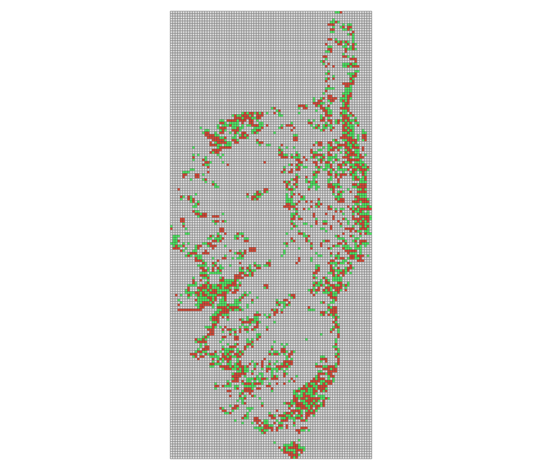

Ce code réalisé sous R permet de créer une grille continue, sur un territoire, basée sur celle du carroyage de l'INSEE, et d'affecter à chaque carreau les valeurs de population de 2010 et 2015

Les données de carroyage utilisées en exemple dans le code sont celles des carreaux de 1km pour ces deux années, sur le territoire Corse (avec EPSG `3035`)

L'intérêt d'avoir un maillage continu est de pouvoir calculer des indicateurs même là où l'on ne compte pas d'habitants, ni en 2010, ni en 2015.

# Illustration

Sur cette image, les zones en rouge comptent plus d'habitants en 2015 qu'en 2010, les zones en vert moins, et celles en grises ne comptent pas d'habitants chacune des deux années.

# Données utilisées
[Carroyage 1km de 2015](https://insee.fr/fr/statistiques/4176293?sommaire=4176305#titre-bloc-7)  
[Carroyage 1km de 2010](https://insee.fr/fr/statistiques/1405815?sommaire=4176305#titre-bloc-4)

# Usage
```r
carr_1km_2010 <- st_read("in/carr_corse_1km_2010_crs3035.gpkg") %>% st_set_crs(3035)
carr_1km_2015 <- st_read("in/carr_corse_1km_2015_crs3035.gpkg") %>% st_set_crs(3035)

f <- make_grid_with_data(carr_1km_2010, 
                         carr_1km_2015, 
                         resolution = 1000, 
                         tolerance = 100)

st_write(f, "grille_1km_corse_pop2010-2015.gpkg")
```

La résolution est, ici, spécifiée à 1km, et un éloignement de moins de 100m entre les centroïdes des deux couches permet d'apparier les carreaux de 2010 et de 2015

## Utilisation sur grand territoire et sur donnée à 200m
Il est tout à fait possible de répliquer le traitement sur une donnée à 200m et sur le territoire national. Les traitements seront en revanche assez longs.

```r
f <- make_grid_with_data(carr_200m_2010, 
                         carr_200m_2015, 
                         resolution = 200, 
                         tolerance = 50)
```


# Librairies
- sf
- raster
- tidyverse

# Méthode
Sur la base de 

# Arborescence

	|--in : contient les données d'entrée utilisées dans l'exemple
	|--script.R : script
	|--script_fxns.R : contient la fonction R d'appariement insee 2010 et insee 2015
	|--projet.qgz : projet QGIS de mise en forme des données
	|--grille_1km_corse_pop2010-2015.gpkg : donnée de sortie au format GeoPackage
	|--image.png : image en sortie illustrant la couche